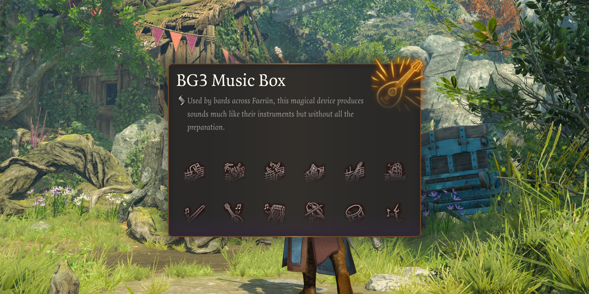

# [BG3 Bard Player](https://bard.sthom.kiwi)

_All of the noise, none of the fun._

A simple player for the bard songs in [Baldur's Gate 3](https://baldursgate3.game/). Select a song, select some instruments and play!

## Why?

After I extracted and converted the sounds from the game (if you ever want to do this yourself, I [made my scripts available](https://github.com/s-thom/bg3-sounds-converter)), I saw a folder for all the bard music. That afternoon I threw the initial version of this site together... then spent the next week actually making it good.

## How?

Whenever you select a song, the site creates 6 `<audio>` elements, and when you click the play button they're all started at the same time. That way they stay in sync. Turning on/off instruments just changes their volume to 100% and 0% respectively.

Don't ask about the CSS behind the image spritesheet.
